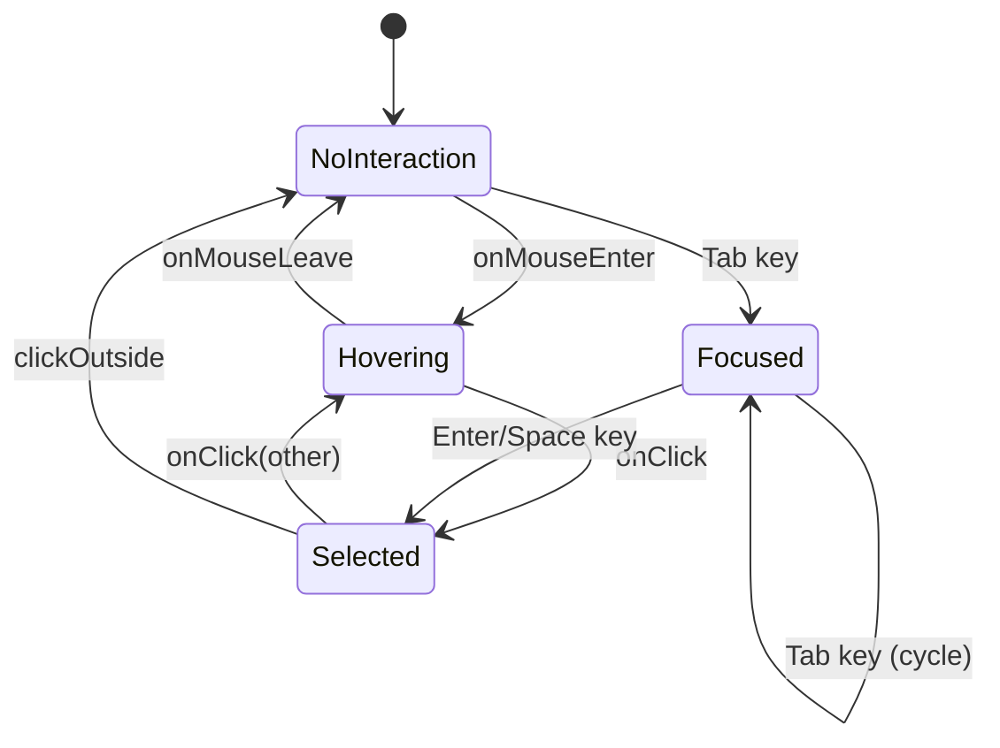
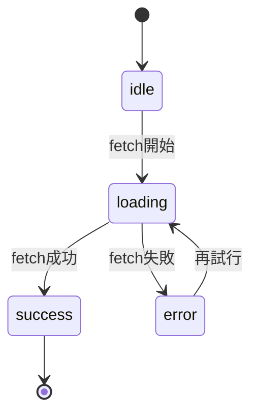
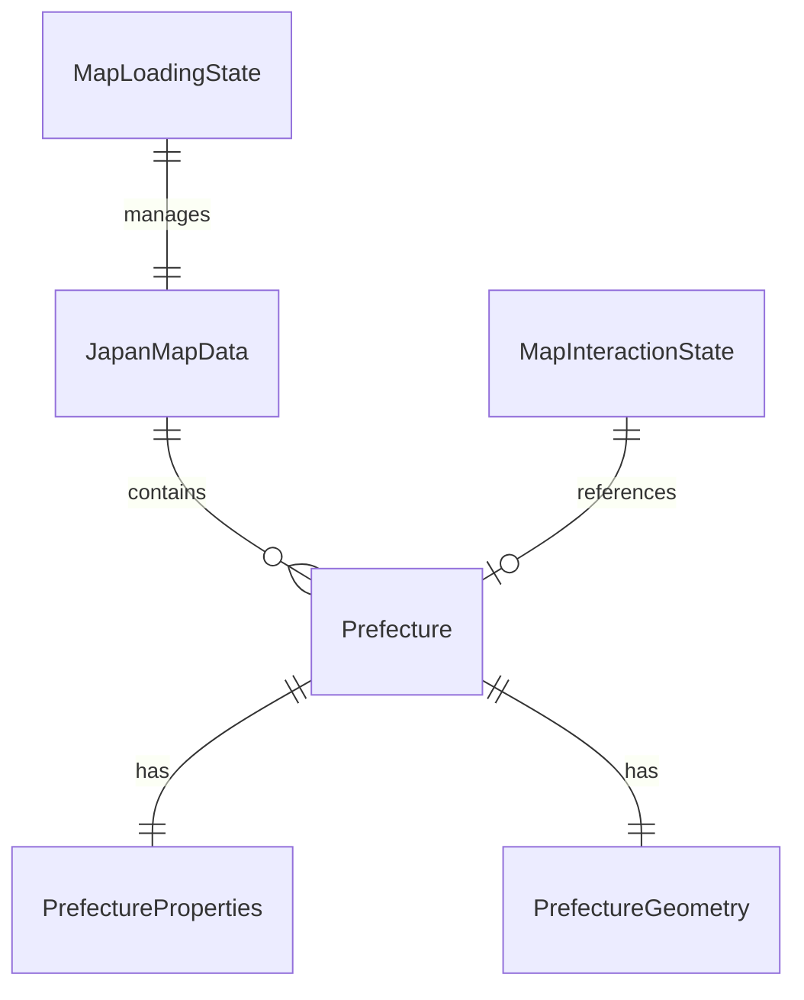
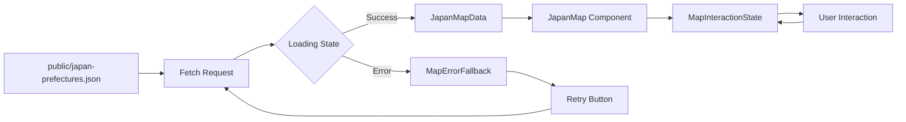

# Data Model: Add Japan Map to Index Page

**Feature**: 001-add-japan-map
**Date**: 2026-02-10

## Overview

この機能では、日本の都道府県地図データを表現するデータモデルを定義します。GeoJSON形式のデータを使用し、TypeScript型安全性を確保します。

## Entities

### 1. Prefecture（都道府県）

**説明**: 日本の都道府県を表すエンティティ

**属性**:
- `name`: 都道府県名（日本語）
- `code`: 都道府県コード（01-47）
- `geometry`: GeoJSON形式の地理データ

**TypeScript型定義**:
```typescript
interface Prefecture {
  type: 'Feature';
  properties: PrefectureProperties;
  geometry: PrefectureGeometry;
}

interface PrefectureProperties {
  /** 都道府県名（例: "北海道", "東京都"） */
  name: string;
  /** 都道府県コード（例: "01", "13"） */
  code: string;
  /** 地域区分（オプション: "北海道", "東北", "関東", etc.） */
  region?: string;
}

interface PrefectureGeometry {
  type: 'Polygon' | 'MultiPolygon';
  coordinates: number[][][] | number[][][][];
}
```

**バリデーションルール**:
- `name`: 必須、空文字列不可
- `code`: 必須、2桁の数値文字列（"01"〜"47"）
- `geometry.type`: "Polygon" または "MultiPolygon" のみ許可
- `geometry.coordinates`: 有効な座標配列

**状態遷移**:
なし（静的データ）

---

### 2. JapanMapData（日本地図データ）

**説明**: 全都道府県を含むGeoJSONコレクション

**属性**:
- `type`: "FeatureCollection"
- `features`: 都道府県の配列

**TypeScript型定義**:
```typescript
interface JapanMapData {
  type: 'FeatureCollection';
  features: Prefecture[];
}
```

**バリデーションルール**:
- `features`: 必須、47要素を含む配列
- 各 `feature` は `Prefecture` 型に準拠

---

### 3. MapInteractionState（地図インタラクション状態）

**説明**: ユーザーの地図操作状態を管理するクライアントサイド状態

**属性**:
- `hoveredPrefecture`: ホバー中の都道府県コード（null = ホバーなし）
- `selectedPrefecture`: 選択中の都道府県コード（null = 選択なし）
- `focusedPrefecture`: キーボードフォーカス中の都道府県コード（null = フォーカスなし）
- `zoom`: ズームレベル
- `center`: 地図の中心座標

**TypeScript型定義**:
```typescript
interface MapInteractionState {
  /** ホバー中の都道府県コード */
  hoveredPrefecture: string | null;
  /** 選択中の都道府県コード */
  selectedPrefecture: string | null;
  /** キーボードフォーカス中の都道府県コード */
  focusedPrefecture: string | null;
  /** ズームレベル（1-8） */
  zoom: number;
  /** 地図の中心座標 [経度, 緯度] */
  center: [number, number];
}
```

**初期値**:
```typescript
const initialState: MapInteractionState = {
  hoveredPrefecture: null,
  selectedPrefecture: null,
  focusedPrefecture: null,
  zoom: 1,
  center: [138, 36], // 日本の中心座標
};
```

**バリデーションルール**:
- `hoveredPrefecture`, `selectedPrefecture`, `focusedPrefecture`: null または有効な都道府県コード（"01"〜"47"）
- `zoom`: 1〜8の数値
- `center`: 長さ2の配列、経度・緯度の範囲内

**状態遷移**:



---

### 4. MapLoadingState（地図読み込み状態）

**説明**: GeoJSONデータの読み込み状態

**属性**:
- `status`: 読み込みステータス
- `error`: エラー情報（エラー時のみ）

**TypeScript型定義**:
```typescript
type MapLoadingStatus = 'idle' | 'loading' | 'success' | 'error';

interface MapLoadingState {
  /** 読み込みステータス */
  status: MapLoadingStatus;
  /** エラー情報（status='error'時のみ） */
  error?: Error;
}
```

**状態遷移**:


## Relationships



**関係性の説明**:
- `JapanMapData` は複数の `Prefecture` を含む（1対多）
- `Prefecture` は `PrefectureProperties` と `PrefectureGeometry` を持つ（1対1）
- `MapInteractionState` は最大3つの `Prefecture` を参照（hoveredPrefecture, selectedPrefecture, focusedPrefecture）
- `MapLoadingState` は `JapanMapData` の読み込み状態を管理

## Data Storage

### Static GeoJSON File

**Location**: `public/data/japan-prefectures.json`

**Format**: GeoJSON FeatureCollection

**Size Target**: < 500KB（TopoJSON変換により約80%削減）

**Update Frequency**: 静的（都道府県境界は変更されない）

**Example Data**:
```json
{
  "type": "FeatureCollection",
  "features": [
    {
      "type": "Feature",
      "properties": {
        "name": "北海道",
        "code": "01"
      },
      "geometry": {
        "type": "MultiPolygon",
        "coordinates": [
          [[[145.82, 43.42], [145.83, 43.43], ...]]
        ]
      }
    },
    {
      "type": "Feature",
      "properties": {
        "name": "青森県",
        "code": "02"
      },
      "geometry": {
        "type": "Polygon",
        "coordinates": [
          [[140.75, 41.39], [140.76, 41.40], ...]
        ]
      }
    }
  ]
}
```

### Client-Side State

**Management**: React `useState` + `useReducer`（シンプルさ原則IVに従い、状態管理ライブラリは不使用）

**Persistence**: なし（ページリロード時にリセット）

**Scope**: コンポーネントローカル

## Data Flow



**フロー説明**:
1. ページロード時に `public/japan-prefectures.json` をフェッチ
2. ローディング状態を `MapLoadingState` で管理
3. 成功時は `JapanMapData` を `JapanMap` コンポーネントに渡す
4. エラー時は `MapErrorFallback` を表示し、再試行ボタンを提供
5. ユーザーインタラクション（ホバー、クリック、キーボード）は `MapInteractionState` で管理
6. 状態変化に応じてコンポーネントが再レンダリング

## Performance Considerations

### Data Optimization

1. **TopoJSON変換**: GeoJSONをTopoJSON形式に変換してファイルサイズを約80%削減
2. **座標精度**: 小数点以下3桁に丸める（視覚的品質を保ちながらサイズ削減）
3. **プロパティ最小化**: 不要な属性を削除（`name` と `code` のみ保持）

### Caching Strategy

- ブラウザキャッシュ: `Cache-Control: public, max-age=31536000`（1年）
- GeoJSONデータは静的なため、長期キャッシュが可能
- バージョン管理: ファイル名にハッシュを含める（例: `japan-prefectures.abc123.json`）

### Memory Management

- GeoJSONデータは一度読み込んだらメモリ上に保持（再フェッチ不要）
- `React.memo()` でコンポーネントの不要な再レンダリングを防止
- `useMemo()` でGeoJSON処理結果をメモ化

## Validation & Error Handling

### Data Validation

```typescript
function validateJapanMapData(data: unknown): data is JapanMapData {
  if (!data || typeof data !== 'object') return false;
  if ((data as JapanMapData).type !== 'FeatureCollection') return false;

  const features = (data as JapanMapData).features;
  if (!Array.isArray(features)) return false;
  if (features.length !== 47) {
    console.warn(`Expected 47 prefectures, got ${features.length}`);
  }

  return features.every(validatePrefecture);
}

function validatePrefecture(feature: unknown): feature is Prefecture {
  if (!feature || typeof feature !== 'object') return false;
  if ((feature as Prefecture).type !== 'Feature') return false;

  const props = (feature as Prefecture).properties;
  if (!props?.name || !props?.code) return false;
  if (!/^\d{2}$/.test(props.code)) return false;

  const geom = (feature as Prefecture).geometry;
  if (!geom || !['Polygon', 'MultiPolygon'].includes(geom.type)) return false;

  return true;
}
```

### Error Scenarios

| エラー | 原因 | 処理 |
|--------|------|------|
| 404 Not Found | GeoJSONファイルが存在しない | エラーUI + 再試行ボタン |
| Network Error | ネットワーク接続失敗 | エラーUI + 再試行ボタン |
| Invalid JSON | JSONパースエラー | エラーUI + 技術詳細 |
| Invalid GeoJSON | データ構造が不正 | エラーUI + バリデーション詳細 |
| Timeout | 読み込みタイムアウト | エラーUI + 再試行ボタン |

## Test Data

### Mock GeoJSON (テスト用)

```typescript
export const mockJapanMapData: JapanMapData = {
  type: 'FeatureCollection',
  features: [
    {
      type: 'Feature',
      properties: { name: '東京都', code: '13' },
      geometry: {
        type: 'Polygon',
        coordinates: [[[139.0, 35.0], [139.5, 35.0], [139.5, 35.5], [139.0, 35.5], [139.0, 35.0]]],
      },
    },
    {
      type: 'Feature',
      properties: { name: '神奈川県', code: '14' },
      geometry: {
        type: 'Polygon',
        coordinates: [[[139.0, 35.0], [139.5, 35.0], [139.5, 34.5], [139.0, 34.5], [139.0, 35.0]]],
      },
    },
  ],
};
```

## Future Considerations

### Potential Extensions (YAGNI原則に従い、現在は実装しない)

- 都道府県ごとのニュースデータ統合
- 地域グループ化（北海道、東北、関東など）
- 都道府県別の統計データ（人口、面積など）
- 多言語対応（英語の都道府県名）
- リアルタイムデータ更新（ニュース件数など）

**現在の実装では上記機能は含めず、シンプルな地図表示とインタラクションのみに集中する。**
